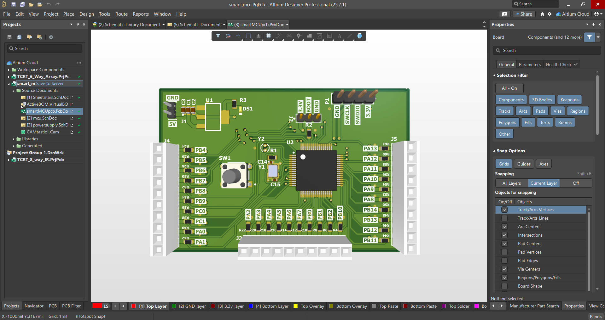

# STM32F401RBT6 Custom Development Board


*Custom-designed STM32F4-based microcontroller development board (Altium Designer)*

---

## 🔧 Project Overview

This project is a **fully custom STM32F401RBT6-based development board** designed entirely in **Altium Designer**. It was created from scratch as a **learning project** to gain hands-on experience in PCB design, layout, and embedded system fundamentals—without relying on ready-made development boards like Arduino or ESP-based modules.

---

## 🎯 Motivation

The **primary motivation** for designing this board was to deeply understand **PCB design principles** and the **hardware design process** surrounding microcontrollers. By building the board from schematic capture to layout and 3D visualization, I learned the intricate relationships between components, routing challenges, and board-level best practices.

---

## 🧠 Core Objective

* To build a **general-purpose development board** that:

  * Breaks out all GPIOs
  * Offers standard debugging/programming headers
  * Supports both high-speed (HSE) and RTC (LSE) clock sources
  * Provides a clean, regulated 3.3V power supply from 5V input
* Eliminate reliance on external dev kits (like STM Nucleo, Arduino, or ESP boards)

---

## 📦 Key Features

* **Microcontroller**: STM32F401RBT6 (ARM Cortex-M4, 256KB Flash, 64KB RAM)
* **Clock Sources**:

  * 8 MHz HSE crystal for core/peripherals
  * 32.768 kHz LSE crystal for RTC
* **Power Supply**:

  * 5V to 3.3V linear regulator (LM1117)
  * Decoupling caps on all VDD/VDDA pins
* **Programming Interface**: SWD (standard 2x5 header)
* **Reset/Boot Options**: User push-button reset, BOOT0 configurable
* **GPIO Access**: Fully broken out headers with labeled pins
* **GPIO Series Resistors**: 1kΩ on all I/Os for protection & flexibility
* **Board Layers**: Custom stack-up with dedicated GND and 3.3V planes

---

## ⚙️ Design Details

### 🔌 Power Supply

* **Regulator**: LM1117 (LDO, 3.3V output)
* **Input Caps**: Standard 10µF + 100nF
* **Output Caps**: 4.7µF × multiple for filtering and stability
* **Power Planes**: Full GND pour; isolated 3.3V plane

### ⏱️ Clocking

* **HSE (Y1)**: 8 MHz ECS crystal with 12 pF caps (C14, C15)
* **LSE (Y2)**: 32.768 kHz cylindrical crystal with 10 pF caps (C16, C17)
* Capacitor values were selected based on STM32F401 datasheet recommendations.

### 🔁 Reset & Boot Circuit

* Reset push-button (SW1) with pull-up and debounce capacitor
* BOOT0 configurable through resistor + jumper header (for boot mode selection via UART)

### 🌐 GPIOs & Connectivity

* 3 headers: J3, J4, J5 — each exposing multiple GPIOs
* Series resistors (1kΩ) to protect against overcurrent, direct LED driving, and to assist with signal integrity and EMI

### 🛠️ Routing Strategy

* All decoupling caps placed close to VDD/VDDA pins
* Crystals placed with short symmetrical traces
* Minimized via use where possible
* GPIOs routed with a focus on symmetry and logical grouping

---

## 🧪 Testing & Bring-Up

> *This board is a learning project and has not yet undergone fabrication or testing.*

### Planned Bring-up Sequence:

1. **Check 3.3V rail**
2. Confirm **reset and boot circuitry**
3. Flash "Blinky" program via **STM32CubeProgrammer** using SWD
4. Validate crystal operation (via scope or code)
5. Begin GPIO/peripheral testing

---

## 💻 Firmware Plan

* **IDE**: STM32CubeIDE or PlatformIO with STM32 support
* **Toolchain**: GCC ARM toolchain with CMSIS/HAL drivers
* **Initial firmware**: GPIO blink test, UART loopback, timer interrupt test

---

## 🔄 Reflections & Learnings

### 📌 Biggest Challenge:

* Routing GPIOs within the constrained area while minimizing via usage
* Understanding the optimal placement of bypass/decoupling capacitors

### 🧠 Key Learnings:

* Handling component density and signal integrity in a compact layout
* Efficient schematic modularization and layout alignment
* Practical use of Altium features: ECO, component filtering, 3D previews

### 💬 Advice for Others:

> **"Start small, go big later."**
> Begin with minimal designs (ATtiny, STM32C0), fabricate early, validate your decisions, and scale up to performance-class MCUs later.

### 🔁 What I'd Improve in v2:

* Start with a smaller MCU for rapid iteration and testing
* Add onboard UART-to-USB for bootloader programming
* Refactor layout for better isolation of analog and digital domains

---

## 📐 Board Specs

| Attribute     | Value                                                      |
| ------------- | ---------------------------------------------------------- |
| Dimensions    | Compact – smallest that fits design                        |
| Layers        | 2 Signal, GND + 3.3V internal                              |
| Stack-up      | Top, Dielectric, GND, Dielectric, 3.3V, Dielectric, Bottom |
| MCU Package   | LQFP64                                                     |
| Passive Sizes | 0603 / 0402 where needed                                   |

---

## 📁 Project Structure

```
smart_mcu/
├── Schematic/
│   ├── mcu.SchDoc
│   ├── powersupply.SchDoc
├── PCB/
│   ├── smartMCUpcb.PcbDoc
│   └── CAMOutputs/
├── 3D/
│   ├── top_render.png
│   └── layout.png
├── BOM/
│   └── smart_mcu_BOM.pdf
├── README.md
└── LICENSE
```

---

## 🔮 Future Plans

* Fabricate the PCB and hand-solder it
* Flash test code and validate peripheral interfaces
* Integrate into robotics or automation projects
* Possibly open-source the design and write a build + bring-up guide for beginners

---

## 📸 Gallery

| 2D PCB Layout                     | 3D Render                            |
| --------------------------------- | ------------------------------------ |
|  |  |

---

## 📞 Contact

If you're working on embedded systems, designing your own microcontroller boards, or learning Altium, let's connect!

**[Austin@Linkedin](https://www.linkedin.com/in/antony-austin-b7287226a/)**
**[Austin@GitHub](https://github.com/austin207/STM32F401RBT6-MCU.git)**
**Article: [Austin@Medium](https://medium.com/@austinantony06/my-journey-in-designing-a-custom-stm32-board-a-learning-experience-380ba05609ac)**
